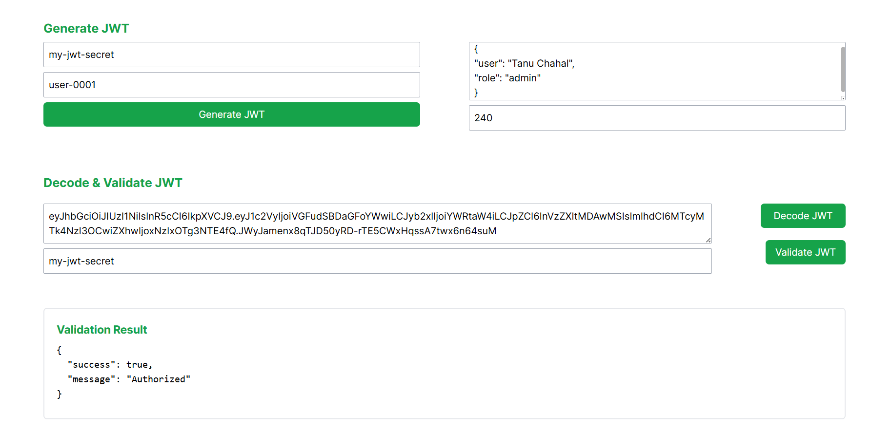

# @tanu-chahal/jwt-library

Encode, decode, and validate JSON Web Tokens (JWTs) with ease.

This library provides simple and efficient methods for working with JWTs in both JavaScript and TypeScript projects.



See Package's Demo [Application](https://jwt-library.vercel.app/) or https://jwt-library.vercel.app/

Use NPM [Package](https://www.npmjs.com/package/@tanu-chahal/jwt-library)

## Directory Structure

NextJS Demo app in  `jwt-library-demo/client`

NPM Package code in `jwt-library`

## Local Setup Guide

### 1. Clone the Repository
First, clone the main repository to your local machine. This repository contains both the JWT library and the demo application.

```bash
git clone <repo-url>
```

### 2. Set Up the JWT Library
Navigate to the `jwt-library `directory to install dependencies and build the package.

```bash
cd jwt-library
```
#### 2.1. Install Dependencies
Use npm to install the necessary dependencies:

```bash
npm install
```

#### 2.2. Build the Package
To build the TypeScript package to generate JavaScript files in the dist folder.

```bash
npm run build
```
This command compiles TypeScript files into JavaScript and outputs them in the dist directory.

#### 2.3. Run Tests
Run tests to ensure everything is working correctly.

```bash
npm test
```

### 3. Set Up the Next.js Demo Application
Navigate to the demo application's directory:

```bash
cd ../jwt-library-demo/client # from package directory
# or
cd jwt-library-demo/client # from root
```
#### 3.1. Install Dependencies
Use npm to install the demo app's dependencies:

```bash
npm install
```

#### 3.2. Run the Demo Application
Start the Next.js development server to view the demo application in your browser.

```bash
npm run dev
```
Open your browser and go to http://localhost:3000 to view the application.

## Support

Feel free to set up the repossitory locally and raise issues & PRs. 

Also, if you like the application kindly give the repo a star ⭐.